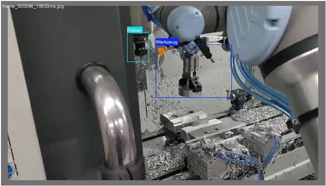

# YOLOv8 Video Object Detection & Tracking

## 📚 Projektbeschreibung
Ziel des Projektes ist zu zeigen, wie sich eine Maschinenstillstandsanalyse in wenigen Schritten durchführen lässt.
Dieses Repository zeigt, wie man mit **YOLOv8** Objekte in Videos erkennt, die Positionen speichert und Bewegungsanalysen durchführt. 

## 📌 Beispiel für die Objekterkennung  

Das folgende Bild zeigt ein Beispiel aus dem Video, in dem der **Roboter das Werkzeug und den Fräser** erkennt:  

  

Falls das Bild in einem Unterordner (`images/`) liegt, ändere den Pfad entsprechend:  

```markdown


## 📚 Funktionen
- 🎥 **Objekterkennung in Videos mit YOLOv8**
- 📊 **Speicherung der Objektpositionen als CSV**
- 📊 **Visualisierung der X- und Y-Positionen über die Zeit**
- ⏰ **Stillstandsanalyse mit Vektoren**
- 🌐 **Live-Analyse mit OpenCV**


## 📌 Installationsanleitung & Abhängigkeiten  

### 🔹 Python-Version  
Dieses Projekt wurde mit **Python 3.11.11** getestet.  
Es wird empfohlen, eine **virtuelle Umgebung** zu verwenden, um Konflikte mit bestehenden Paketen zu vermeiden.  

---

### 🔹 Benötigte Abhängigkeiten  
Folgende Python-Pakete sind für das Projekt erforderlich:  
- `ultralytics` → YOLOv8 für Objekterkennung & Training  
- `opencv-python` → Verarbeitung & Anzeige von Videos & Bildern  
- `pandas` → Speicherung & Analyse der erkannten Objektdaten  
- `matplotlib` → Visualisierung der X- & Y-Positionen  
- `numpy` → Berechnung der Stillstandsvektoren  

Diese sind in der Datei **`requirements.txt`** hinterlegt und können mit folgendem Befehl installiert werden:  

```bash
pip install -r requirements.txt
```
---

## 🔧 Vorgehensweise

### **Schritt 1:** Video der Aufgabe erstellen oder herunterladen.
### **Schritt 2:** Frames des Videos extrahieren und Bilder in einem Ordner speichern.
### **Schritt 3:** Labelme über `pip` installieren:
```bash
pip install labelme
```

### **Schritt 4:** Objekte in den Frames mit Labelme labeln und als JSON speichern (mindestens 100 Bilder für gute Erkennungsrate).

### **Schritt 5:** JSON-Labelinformationen in YOLO TXT-Format umwandeln und Bilder in Training & Validierung aufteilen.

### **Schritt 6:** YOLO über `pip` installieren:
```bash
pip install ultralytics
```

### **Schritt 7:** YOLO-Training durchführen:
```bash
python scripts/train.py --epochs 50 --data dataset/data.yaml
```

### **Schritt 8:** Bewertung der Ergebnisse und Testen mit unannotierten Bildern.

### **Schritt 9:** Test des YOLO-Modells auf einem Live-Video der gleichen Aufgabe:
```bash
python scripts/video_detection.py --video data/sample.mp4
```

### **Schritt 10:** Ergänzung der Datenerfassung für erkannte Objekte (Zeitstempel, Position X/Y) und Speicherung in JSON/CSV.

### **Schritt 11:** Auswertung der Daten zur Überprüfung der Objektbewegung und Stillstandsanalysen.

---

## 🛠️ Installation
### 1. **Python & Abhängigkeiten installieren**
```bash
pip install -r requirements.txt
```

### 2. **Repo klonen** (Falls du Git nutzt)
```bash
git clone https://github.com/dein-username/yolo-video-detection.git
cd yolo-video-detection
```

---

## 🎥 Verwendung
### **1. YOLO-Training (optional)**
Falls du dein eigenes Modell trainieren willst, nutze folgendes Kommando:
```bash
python scripts/train.py --epochs 50 --data dataset/data.yaml
```

### **2. Live-Objekterkennung in Videos**
```bash
python scripts/video_detection.py --video data/sample.mp4
```

### **3. Positions- & Bewegungsanalyse speichern**
```bash
python scripts/analyze_positions.py --csv results/object_detections.csv
```

---

## 🏆 Beispielcode: Objekterkennung in Videos
```python
import cv2
from ultralytics import YOLO

model = YOLO("models/best.pt")
cap = cv2.VideoCapture("data/sample.mp4")
while cap.isOpened():
    ret, frame = cap.read()
    if not ret:
        break
    results = model(frame)
    for result in results:
        for box in result.boxes:
            x1, y1, x2, y2 = map(int, box.xyxy[0])
            label = model.names[int(box.cls[0])]
            cv2.rectangle(frame, (x1, y1), (x2, y2), (0, 255, 0), 2)
            cv2.putText(frame, label, (x1, y1 - 10), cv2.FONT_HERSHEY_SIMPLEX, 0.6, (0, 255, 0), 2)
    cv2.imshow("YOLO Live Detection", frame)
    if cv2.waitKey(1) & 0xFF == ord('q'):
        break
cap.release()
cv2.destroyAllWindows()
```

---

## 📈 Beispiel: Stillstandsanalyse
```python
python scripts/analyze_stillstand.py --csv results/object_detections.csv --threshold 10 --frame-step 5
```

---

## 🛠️ To-Do
- [ ] Weitere Visualisierungen hinzufügen
- [ ] Webinterface mit Streamlit implementieren
- [ ] Erweiterung auf Echtzeit-Webcam-Daten

---

## 🏆 Autor
**Hubert Würschinger**  
LinkedIn: [Hubert Würschinger](https://www.linkedin.com/in/hubert-w%C3%BCrschinger-82031813b/)  
GitHub: [Hubert Wuerschinger](https://github.com/HubertWuerschinger)

---

## ✨ Lizenz
Dieses Projekt steht unter der **MIT-Lizenz**. Fühle dich frei, es zu nutzen und anzupassen! 🚀

